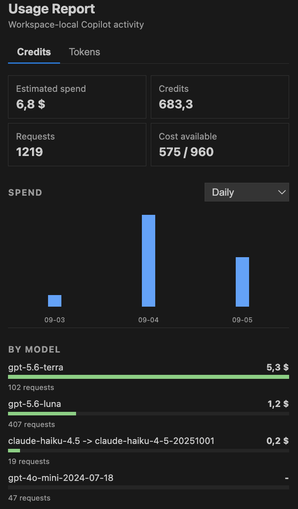
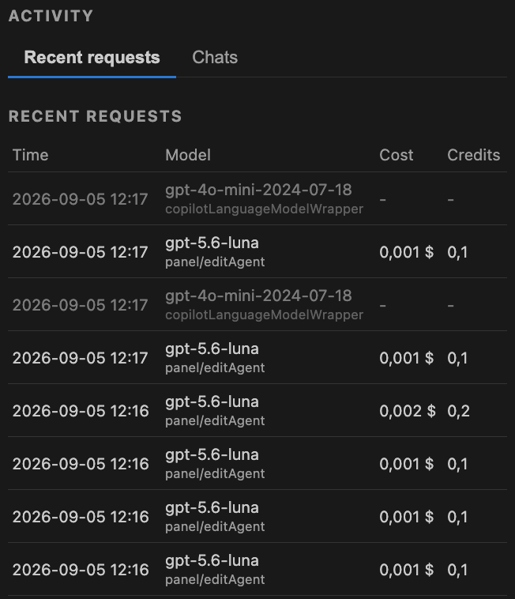
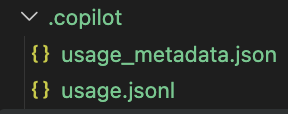

## Copilot Cost Counter

> **Note:** Use this extension at your own discretion. This has been a vibe-coded project from the start, so review its behavior and do not rely on its estimates for billing decisions without independent verification.

**Version:** 0.2.70

Track GitHub Copilot request activity in VS Code with workspace-local cost, AI-credit, token, model, feature, and conversation reports.

Copilot Cost Counter is a companion extension for GitHub Copilot for VS Code. It reads completed request entries from Copilot's output log and records summaries in the current workspace. It does not send usage data to a separate service.

> **Important:** This extension is not affiliated with or endorsed by GitHub or Microsoft. Cost values are estimates unless Copilot provides an authoritative AI-credit total. Read [Recorded Data And Limits](#recorded-data-and-limits) before relying on the figures for billing decisions.

## Screenshots

The report provides a workspace-local overview of estimated spend, AI credits, requests, models, and daily activity.



Recent requests can be inspected separately, including the model, Copilot feature, estimated cost, and credits when available.



Usage records and chat metadata are stored in the workspace's `.copilot` directory.



The values shown in these screenshots are example data and do not represent a billing statement.

## Features

- Workspace-local spend and AI-credit totals
- Token totals for prompt, fresh input, cached input, cache writes, and output
- Spend charts grouped by day, conversation, or Copilot feature
- Model breakdown and recent request activity
- Conversation and turn grouping when Copilot exposes reliable IDs
- Configurable model pricing overrides and display currency
- Optional money-burn animation after estimated requests

## Requirements

- VS Code 1.85 or later
- GitHub Copilot for VS Code

## Install From A VSIX

For a local build, install Node.js 20 or later and npm, then run:

```sh
npm install
npm run package
```

`npm run package` first snapshots the current codebase to `versions/<previous-version>/codebase`, increments the patch version, and prepends a release summary to the root `CHANGELOG.md`. The summary uses Git commit messages since the previous packaged version. Each version folder stores `RELEASE.json`, which records the version and its Git commit so later release notes have a stable comparison point. Supply an explicit release note with `npm run package -- --comment "Comment here"`. Packaging then compiles the extension and creates `packages/copilot-cost-counter-<version>.vsix`. Snapshots exclude generated folders such as `node_modules`, `dist`, `packages`, and other version snapshots. Install that generated VSIX with **Extensions: Install from VSIX...** or:

```sh
code --install-extension ./packages/copilot-cost-counter-<version>.vsix
```

Restart or reload VS Code after installation. Once published, the extension can also be installed from the Visual Studio Code Marketplace by searching for **Copilot Cost Counter**.

## Privacy

The extension stores only request metadata and calculated usage summaries in `.copilot/usage.jsonl` and `.copilot/usage_metadata.json` inside the current workspace. It deliberately does not persist prompts, responses, tool arguments, or raw Copilot request documents. Request IDs, model names, feature names, timestamps, token counts, tool names, chat titles, and conversation IDs may still be sensitive in some workspaces. Keep the `.copilot` directory private and do not commit it to a public repository.

## Configure The Log

The `copilotCostCounter.logPath` setting is intentionally empty by default. An empty value is the recommended mode: the extension automatically searches the current VS Code window’s extension-host log directory for the most recently updated `GitHub Copilot Chat.log`. The discovered path is used at runtime and is not written into the setting. Copilot’s logs are commonly outside the workspace, so configure an explicit path only when automatic discovery does not find the right session:

1. Run `Copilot Cost Counter: Choose Output Log` and select the log file.
2. Set `copilotCostCounter.logPath` in workspace settings. Relative paths are resolved from the first workspace folder; absolute paths are accepted.

The extension starts at the end of logs that already exist when it activates, then records each newly completed `ccreq` request once. This prevents extension reinstalls or deletion of `.copilot/usage.jsonl` from replaying historical VS Code logs. Use `Copilot Cost Counter: Open Workspace Usage` to open `.copilot/usage.jsonl`.

Use the Usage Report view title menu for Refresh and Open Workspace Usage. The gear button beside that menu opens the extension settings.

Raw Copilot logs and generated usage records may contain private workspace or request information. They are excluded by `.gitignore`; do not force-add them to a public repository.

## Usage Report

After installation, select the **Copilot Cost Counter** graph icon in the Activity Bar to open the workspace-local report. It shows:

- Estimated USD spend and AI credits
- Request count and records with available cost data
- Estimated spend grouped by day, conversation, or Copilot feature
- Cost and request counts by model
- The twenty most recent requests

Use **Refresh** in the report when needed. The report also refreshes when the extension appends a new request. Values are calculated only from records written to the current workspace’s `.copilot/usage.jsonl`. When a `ccreq` document contains `usage.copilot_usage.total_nano_aiu`, that Copilot-reported AI-credit total is authoritative, including an explicit zero; token-price calculations are used only as a fallback when the AIU total is absent.

Use the **Credits** and **Tokens** tabs to switch between dollar/AI-credit totals and token totals. The **Spend** selector switches the chart among daily activity, the highest-cost conversations, and the highest-cost Copilot features; its selection persists when new data refreshes the report. The lower **Activity** section has **Recent requests** and **Chats** tabs. Chats include regular chat orchestration such as `backgroundTodoAgent` and `tool/runSubagent-*`; subagent costs are assigned to their parent chat turn when Copilot logs that relationship. Completions, next-edit suggestions such as `copilot-nes-lysithea-24`, and utility requests such as `XtabProvider` are excluded. Chat requests are grouped as conversation, turn, and individual request only when Copilot exposes an explicit conversation ID or a title utility result that can provide a fallback identity. Generic session IDs are not used as conversation IDs because they can span multiple chats. Requests before the first reliable chat identity remain visible in Recent requests and usage totals but are not merged into a misleading `Older requests without chat metadata` conversation. For identified chats, the extension resolves names from explicit Copilot titles or the persisted first user message associated with that conversation. Unnamed chats are shown by a shortened conversation ID. Chat titles, chat IDs, observed turn IDs, and timestamps are maintained in the versioned `.copilot/usage_metadata.json` document; request usage and cost records remain in `.copilot/usage.jsonl`. The extension cannot open a private Copilot chat panel directly through the public VS Code API. The selected tabs persist when new data refreshes the report.

When token counts are present but a model has no input or output rate, the report shows a gray warning naming the model and points to `copilotCostCounter.modelPricingOverrides`.

## Generated Pricing

`npm run compile` fetches the [GitHub Copilot models and pricing](https://docs.github.com/en/copilot/reference/copilot-billing/models-and-pricing) page before compiling. It generates:

- `src/pricing.generated.json`, packaged and used as the offline pricing catalog
- `pricing.generated.csv`, a human-readable export

Each pricing row has a `since` date. Unchanged prices are not duplicated on later builds; changed model, tier, or threshold prices are appended with the build date while previous rows remain in history. Rates are stored per million tokens. GitHub defines `1 AI credit = $0.01 USD`.

To refresh only the generated artifacts:

```sh
npm run fetch-pricing
```

## Recorded Data And Limits

Records contain a numeric `schemaId`, timestamp, request ID, optional explicit chat and turn IDs, an optional transient conversation title, model, raw feature, derived request type, duration, token counts when present in the log, tool names and call count when available, pricing rates, USD costs, and AI-credit costs. New records use schema `7`; records without a schema ID are treated as schema `1` and upgraded during reconciliation. Request types are `chat`, `completion`, `nextEditSuggestion`, and `utility`. The type is inferred from Copilot's feature label; stored records are reclassified during reconciliation when the classifier changes. Tool arguments and prompt/response content are deliberately not persisted because they may contain private workspace data. The `requestId`, `ourRequestId`, and `serverRequestId` values in a `ccreq` document identify the individual request, not the surrounding chat session.

A companion extension cannot access Copilot’s private in-memory telemetry through the public VS Code extension API. Exact per-request billing requires Copilot to emit token usage in the log or expose it through a supported API.

## Pricing Overrides

For models that are not listed on GitHub’s public pricing page, configure rates in `copilotCostCounter.modelPricingOverrides`. Rates are USD per million tokens. The `input` and `output` values are required; `cachedInput` and `cacheWrite` are optional.

Example workspace settings:

```json
{
	"copilotCostCounter.modelPricingOverrides": {
		"gpt-4o-mini-2024-07-18": {
			"input": 0.15,
			"cachedInput": 0.075,
			"output": 0.6
		},
		"my-custom-model": {
			"input": 1.0,
			"output": 4.0
		}
	}
}
```

Model names are normalized before matching, so names with version or provider formatting differences can be entered as they appear in the Copilot log. Overrides are used for newly recorded requests; existing JSONL records are not rewritten.

The Settings editor exposes the override object as a custom-model map. Add a model name as a property and set its `input` and `output` rates; `cachedInput` and `cacheWrite` are optional. Rates remain USD per million tokens even when the report uses another display currency.

## Display Currency

Set `copilotCostCounter.currency` to `USD`, `EUR`, `GBP`, `SEK`, `NOK`, or `DKK`. Because pricing sources are USD-based, set `copilotCostCounter.currencyConversionRate` to the number of display-currency units per USD. Stored JSONL costs remain in USD; the report and money-burn animation use the selected display currency.

## Money-Burn Animation

Enable `copilotCostCounter.showMoneyBurn` to display the estimated spend after a request. The animation can be customized with:

- `copilotCostCounter.moneyBurnDurationMs` for the duration in milliseconds
- `copilotCostCounter.moneyBurnSizePx` for the amount's font size in pixels
- `copilotCostCounter.moneyBurnOrigin` for `top-left`, `top-right`, `bottom-left`, or `bottom-right`
- `copilotCostCounter.moneyBurnThresholdUsd` for the cumulative USD threshold before it fires

The threshold defaults to `0`, which shows an animation for every estimated request. With a positive threshold, estimated costs accumulate and the animation fires each time a threshold block is crossed. Any remainder carries into the next request. For example, a `$0.70` request with a `$0.50` threshold displays `$0.50` and carries `$0.20` forward. Sub-cent amounts use additional decimal places when shown in the animation.

## Development

Run the TypeScript compiler without creating a VSIX:

```sh
npm run compile
```

The Usage Report markup is kept in `templates/report.html` and its reusable fragments are in the same directory. Edit those HTML files to change the report layout, styles, labels, or client-side interactions; TypeScript supplies the calculated values.

To run the extension under the VS Code Extension Development Host, open this directory in VS Code and press `F5`.
